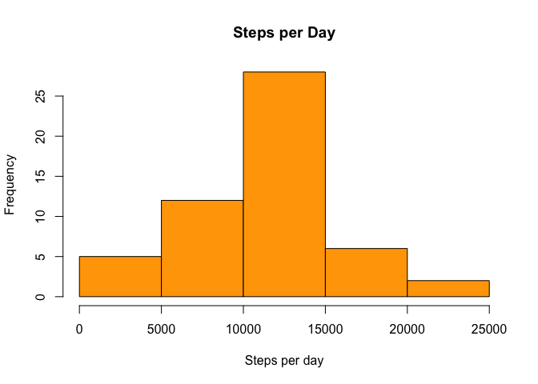
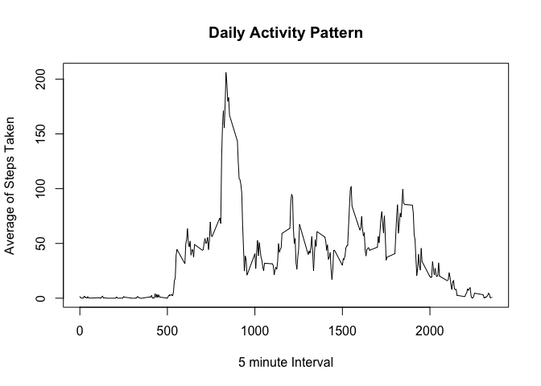
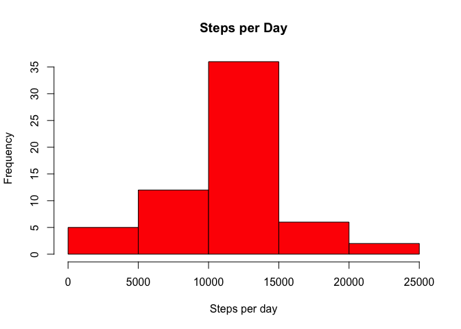

# Reproducible Research: Peer Assessment 1
Jr Enriquez  
## Setting up R
We're going to need some libraries in order to make this project easier. In this case we'll use dplyr

```r
library(dplyr)
library(lattice)
```


## Loading and preprocessing the data
The data consists of two months of data from an anonymous individual collected during the months of October and November, 2012 and include the number of steps taken in 5 minute intervals each day.  

##### Variables

* steps: Number of steps taking in a 5-minute interval (missing values are coded as NA)

* date: The date on which the measurement was taken in YYYY-MM-DD format

* interval: Identifier for the 5-minute interval in which measurement was taken  

This code loads the csv into a data frame and converts the column classes

```r
dataset <- read.csv(file = "activity.csv",header = TRUE)
dataset$date <- as.Date(dataset$date,"%Y-%m-%d")
```

## What is mean total number of steps taken per day?
First we need to calc the total of steps for each day and put it into a graph for ease of understanding. We'll remove the NA even that this reduce our sample from 61 to 53. But it will bias our research to asume a zero on this dates. 


```r
stepsday <- group_by(dataset,date)
stepsday <- filter(stepsday,!is.na(steps))
stepsday<-summarise(stepsday,stepsday=sum(steps,na.rm = T))
hist(stepsday$stepsday, main = "Steps per Day",xlab = "Steps per day",ylab = "Frequency",col = "orange")
```

 

Once we calc the total steps per day we can use the proccessed data to calc the mean. 

```r
stepsdaymean <- mean(stepsday$stepsday)
stepsdaymedian <- median(stepsday$stepsday)
```

* #### **Mean of steps per day: 1.076619\times 10^{4}**
* #### **Median of steps per day: 10765**
As you can see above the mean 1.076619\times 10^{4} and the median 10765 are pretty close. 

## What is the average daily activity pattern?
Sometimes it is convinient to see a timeseries in a graphic way. It is the easier way to visualize some patterns. 


```r
patternday <- group_by(dataset,interval)
patternday <- summarise(patternday,meaninterval=mean(steps,na.rm = T))
plot(patternday$interval,patternday$meaninterval,type = "l", main = "Daily Activity Pattern",xlab = "5 minute Interval", ylab = "Average of Steps Taken")
```

 

Now that we can see how the sample behaves during the day. We can answer the following question:  
**Which 5-minute interval, on average across all the days in the dataset, contains the maximum number of steps?** 

```r
maxsteps<-filter(patternday,meaninterval==max(meaninterval))
```


In average the time with most steps is **8:35** with **206.17** steps


## Imputing missing values

1. Calculating how many missing values exist in the dataset. 


```r
missingdata<-filter(dataset,is.na(steps))
nacount<-length(x = missingdata$steps)
nacount
```

```
## [1] 2304
```

2. Devise a strategy to fill the NA

We consider a good strategy to use the mean of the 5 mins interval for each NA. This means the following: If the NA ocurrs at **8:35** (where most steps happen) we replace the NA with **206.17** that is the mean of steps that happen at this time of the day. This times are already calc in the dataframe Paternday. 


```r
missingdata<-select(missingdata,date,interval)
missingdata<-inner_join(missingdata,patternday)
```

```
## Joining by: "interval"
```

```r
missingdata<-select(missingdata,steps=meaninterval,date,interval)
```

3. Create a new dataset that is equal to the original dataset but with the missing data filled in


```r
newdata<-rbind(filter(dataset,!is.na(steps)),missingdata)
```

4. Make an Histogram and calc the mean and median.

We're going to borrow the code and process used in the first question. 


```r
newstepsday <- group_by(newdata,date)
newstepsday<-summarise(newstepsday,stepsday=sum(steps,na.rm = T))
hist(newstepsday$stepsday, main = "Steps per Day",xlab = "Steps per day",ylab = "Frequency",col = "red")
```

 


```r
newstepsdaymean <- mean(newstepsday$stepsday)
newstepsdaymedian <- median(newstepsday$stepsday)
```

## Are there differences in activity patterns between weekdays and weekends?


```r
newdata<-mutate(newdata,typeday= weekdays(date))
newdata<-mutate(newdata,typeday= ifelse(typeday=="Sunday", "Weekend", ifelse(typeday=="Saturday","Weekend","Weekday")))
newpatternday <- group_by(newdata,interval,typeday)
newpatternday <- summarise(newpatternday,meaninterval=mean(steps,na.rm = T))
xyplot(meaninterval ~ interval | typeday, newpatternday, type = "l", layout = c(1, 2),xlab = "Interval", ylab = "Number of steps")
```

 

